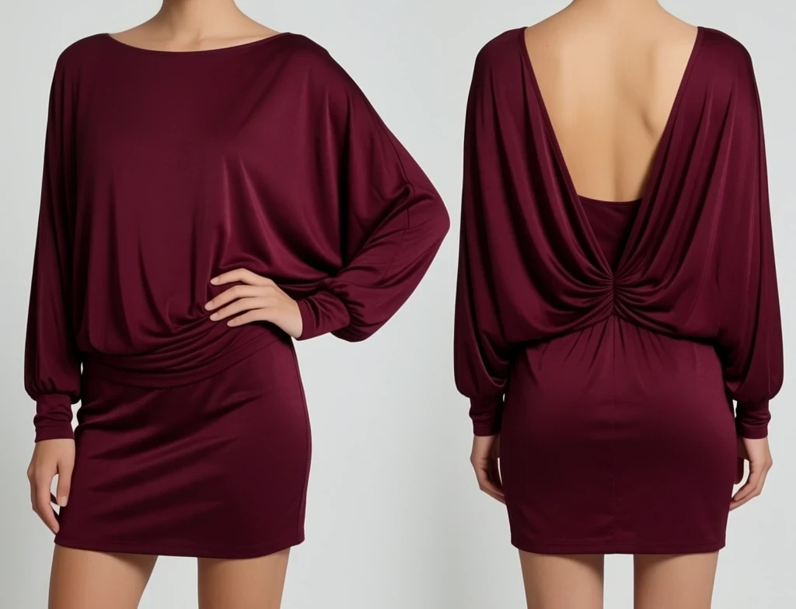
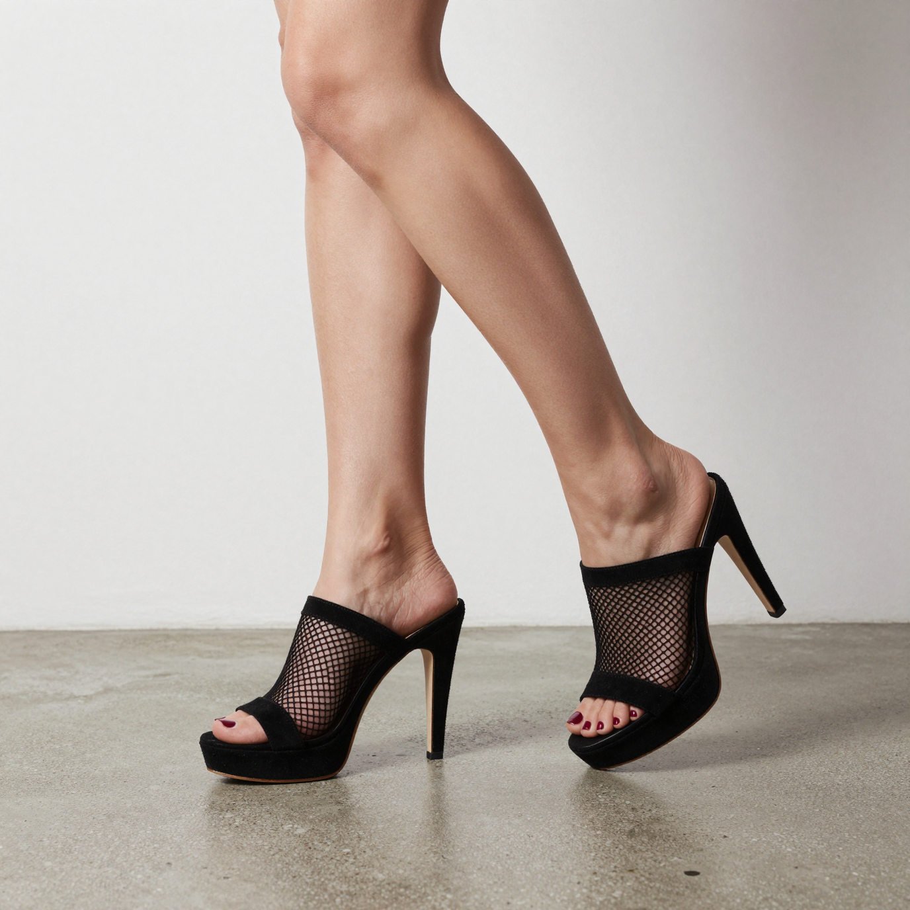
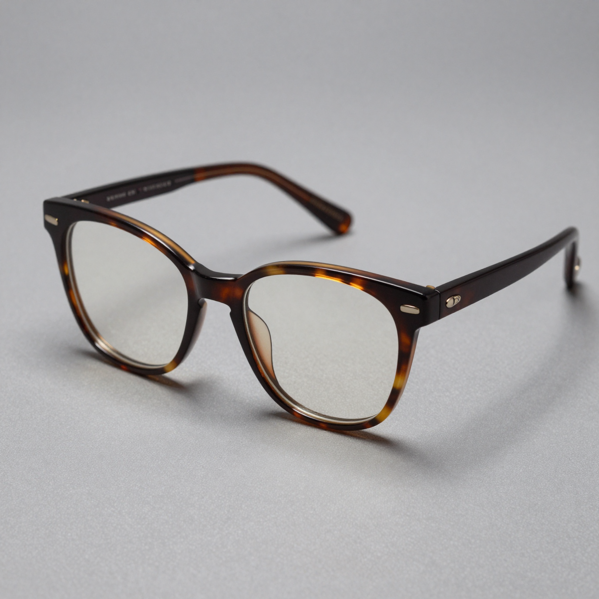
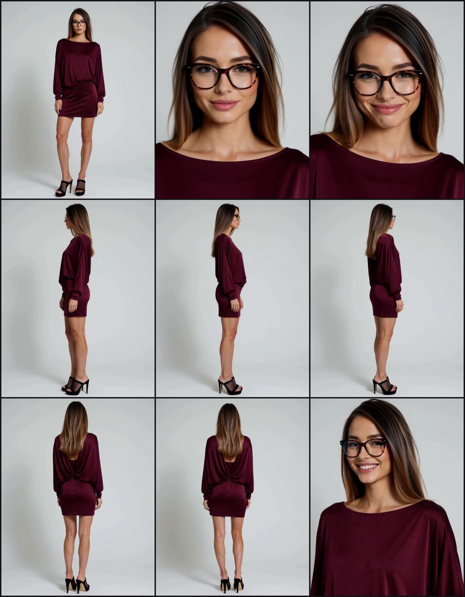

# ComfyUI-H3LookSheets

Reference sheets of a person wearing a specific look, built on **MiniMax H3**'s
multi-reference conditioning (`ref2va`).

Reference images go in — the person, and the look (an outfit, shown in one
or several photos, with hairstyle, makeup and accessories planned) — and H3
renders that person, in that look, from every angle the sheet needs.

Built around `MiniMaxH3ReferenceToVideo`: describe the references, write
the shot-by-shot prompt, generate, pick the frames worth keeping out of the
rendered move, lay them out as one sheet.

> **v1**: one person photo + one outfit photo, each captioned by **Describe
> Reference**; a shot-by-shot prompt built from up to 15 **Shot Config**
> nodes; **Select Frames** to pick the keepers out of the rendered take; and
> **Datasheet Settings** to lay them out as one contact sheet.
>
> **v1.1**: describe up to 8 outfit reference photos at once (front/back per
> garment, up to 4 accessories), auto-detects the person's gender, and adds
> an **Image Aggregator** node to route everything into
> `MiniMaxH3ReferenceToVideo`'s 9 fixed reference slots.

📺 [Demo videos](https://www.youtube.com/playlist?list=PLR0q7a2fnl5w)

<details>
<summary><b>v1</b> — person + outfit references in, look sheet out</summary>

| Picture 1 — Person | Picture 2 — Outfit |
|---|---|
|  |  |


</details>

<details open>
<summary><b>v1.1</b> — person + outfit + accessories references in, look sheet out</summary>

| Person (front/back) | Outfit (front/back) | Shoes | Glasses |
|---|---|---|---|
|  |  |  |  |



</details>

---

## The pipeline, node by node

Each step feeds the next; only step 5 is a core ComfyUI/MiniMax H3 node, not
part of this pack.

1. **Load the reference photos** (`LoadImage` — the person, usually one
   photo, and the look, one or several photos: front/back of a garment,
   shoes, accessories…).
2. **Describe them** with two **Describe Reference** nodes: `target=person`
   with the person photo(s) on `image_0`, `image_1`…, `target=outfit` with the
   outfit photo(s) → `description` (JSON, one entry per image) + `images`.
3. **Route the images**: both `images` outputs go into **Image Aggregator**
   (`images_person`, `images_outfit`) → `ref_image_0` … `ref_image_8`, in the
   order the prompt numbers them.
4. **Write the prompt**: both `description` outputs, plus `Shot Config` ×N for
   however many shots the sheet needs, go into **Look Sheet Prompt - Custom
   Shots** → `prompt`.
5. **Generate**: `prompt`, the 9 `ref_image_N`, `clip`, `vae` and `audio_vae`
   go into `MiniMaxH3ReferenceToVideo` (core node), then through your usual
   sampler and VAE decode → a batch of decoded frames.
6. **Pick the keepers**: the decoded frames go into **Select Frames** →
   `frames`.
7. **Lay them out**: `frames` goes into **Datasheet Settings** → `sheet`
   (IMAGE), the finished contact sheet.

```
LoadImage (person) ─► Describe Reference (target=person) ─► description ─────────┐
                                        │ images                                  │
LoadImage (outfit) ×N ─► Describe Reference (target=outfit) ─► description ──────┤
                                        │ images                                  ▼
                                        ▼                 Look Sheet Prompt - Custom Shots ─► prompt
                                Image Aggregator ─► ref_image_0…8                 │
                                        │                                         │
                                        └──────────────► MiniMaxH3ReferenceToVideo ◄┘
                                                                  │
                                                                  ▼
                                                   sampler ─► VAE decode ─► decoded frames
                                                                  │
                                                                  ▼
                                                          Select Frames ─► frames
                                                                  │
                                                                  ▼
                                                       Datasheet Settings ─► sheet (IMAGE)
```

---

## Nodes

| Node | Category | What it does |
|---|---|---|
| **Look Sheet Prompt - Custom Shots (H3)** | `H3LookSheets` | Writes the ref2va prompt from a freely chosen list of 1–15 shots (`H3LookSheetsCustomPrompt`) |
| **Shot Config (H3 Look Sheet)** | `H3LookSheets` | One shot's angle/framing/expression, packed for the node above (`H3LookSheetsShotConfig`) |
| **Describe Reference (H3 Look Sheet)** | `H3LookSheets` | One-sentence vision description per reference photo (up to 8), with retry and fallback prompts (`H3LookSheetsDescribe`) |
| **Image Aggregator (H3 Look Sheet)** | `H3LookSheets` | Routes the person and outfit images into `MiniMaxH3ReferenceToVideo`'s 9 `ref_image` slots (`H3ImageAggregator`) |
| **Select Frames (H3 Look Sheet)** | `H3LookSheets` | Picks reference frames out of the rendered take (`H3LookSheetsSelectFrames`) |
| **Datasheet Settings (H3 Look Sheet)** | `H3LookSheets` | Lays the picked frames out as one contact-sheet image (`H3LookSheetsDatasheetSettings`) |

---

### Look Sheet Prompt - Custom Shots (H3)

Writes the `subject_definitions` / `summary` / `retention_analysis` /
`detailed_description` prompt `MiniMaxH3ReferenceToVideo` expects, referencing
`<Picture 1>` (the person — or `<Picture 1>`, `<Picture 2>`... when the
person is shown across several photos too) and the look, numbered right
after however many person photos there were, per H3's ref2va guide.

The shot list itself is not fixed. Up to 15 `shot_N` sockets (plug one, the
next appears), each fed by a **Shot Config** node — however many are
actually connected becomes the shot count.

`person_description` / `outfit_description` take either plain text or
**Describe Reference**'s JSON output directly: each JSON entry becomes its
own `<Picture N>`, so the tags always match the images wired into
`MiniMaxH3ReferenceToVideo` — person photo(s) first, then outfit photo(s). An
outfit entry left empty (Describe gave up on that image) is kept as "the
outfit shown" so the numbering never shifts.

| Input | Type | Notes |
|---|---|---|
| `person_description` | STRING | From `Describe Reference` (`target=person`) or written by hand |
| `outfit_description` | STRING | From `Describe Reference` (`target=outfit`) or written by hand |
| `person_gender` | `auto` / `female` / `male` | Auto-detects from the first person description's wording; override when needed |
| `backdrop` | STRING (multiline) | Default: plain light neutral grey studio backdrop |
| `video_duration_seconds` | FLOAT | The take's real length — feed it from whatever sets `length` on `MiniMaxH3ReferenceToVideo`, divided by however many shots are connected |
| `shot_0` … `shot_14` | STRING (Autogrow) | Each fed by a **Shot Config** node |

### Shot Config (H3 Look Sheet)

Three inline dropdowns, packed into one string for the node above.

| Combo | Options |
|---|---|
| `angle` | front, front 3/4 left, front 3/4 right, left profile, right profile, back 3/4 left, back 3/4 right, back |
| `framing` | extreme wide shot, wide shot (full body), medium wide shot (knees-up), medium shot (waist-up), medium close-up (chest-up), close-up (shoulders/face), extreme close-up (eyes/detail) |
| `expression` | neutral, happy, smiling, sad, angry, surprised, scared, disgusted, shy/embarrassed, confident, serious, laughing, crying, smirking, confused |

Pick angle and framing together with the subject visible — e.g. `back` +
`close-up (shoulders/face)` shows no face for the expression to read on.

---

### Describe Reference (H3 Look Sheet)

Wraps core's `TextGenerate` node with one of two fixed system prompts
selected by `target`:

| `target` | Asks the vision model to… |
|---|---|
| `person` | Describe face, hair, eyes, skin, body shape; ignore outfit and clothes |
| `outfit` | Describe the outfit and accessories only; skip hair |

One node per target. `images` is an Autogrow input (`image_0` … `image_7`,
plug one, the next appears): the person is usually one photo, but can be
several (e.g. front + back); the outfit can be shown across up to 8 photos.
Connect them in the order they should reach `MiniMaxH3ReferenceToVideo`.

| Output | Notes |
|---|---|
| `description` | JSON, one entry per connected image: `{"person_0": "..."}` or `{"outfit_0": "...", "outfit_1": "...", ...}`. Plug straight into `person_description`/`outfit_description` on **Look Sheet Prompt - Custom Shots** |
| `debug` | Per image: the exact system prompt sent and every raw reply, retries included |
| `images` | The connected images, same order as `description` — wire into **Image Aggregator** |

With `target=outfit`, per-category combos appear to say which connected image
is the source for what:

| Combo | Use |
|---|---|
| `top_image_front` / `top_image_back` | Top, front and back view |
| `bottom_image_front` / `bottom_image_back` | Bottom (skirt, trousers, dress bottom), front and back view |
| `shoes_image` | Shoes |
| `accessory_image_1` … `accessory_image_4` | Up to 4 distinct accessories, each from its own photo (e.g. glasses in one, a bag in another) |

All default to `auto` (each image describes the whole outfit). As soon as
one is set, each image describes only what it was assigned and skips what
another image covers — so two photos that both show shoes don't produce two
pairs. Set a `..._back` only when the back actually differs from the front.

Retries automatically (up to 3 times, with a new seed) on an empty reply, a
refusal, a leaked chat-template role tag, or — for an image assigned a
category — a "there's none here" answer. If that still fails, one more try
runs with a simpler fallback prompt; an image that still fails gets an empty
entry, the others are kept.

Inherited from `TextGenerate`: `max_length`, `sampling_mode` (on/off +
temperature/top_k/top_p/seed/…), `thinking`, `use_default_template`. `video`
and `audio` inputs are dropped — this node only describes still images.

---

### Image Aggregator (H3 Look Sheet)

Concatenates `images_person`, `images_outfit`, `images_extra_1`,
`images_extra_2` (each a single image or a list, e.g. **Describe Reference**'s
`images` output), in that order, onto `ref_image_0` … `ref_image_8`. Wire all 9
into `MiniMaxH3ReferenceToVideo`; unused slots come out empty and are skipped
like a disconnected socket. Past 9 images, the rest are dropped with a
warning. `images` returns the same images as one list.

---

### Select Frames (H3 Look Sheet)

Picks `saved_frame_count` reference frames out of the rendered take, via a
fixed three-tier cascade:

1. **Tier 1 — cluster by content.** Groups the leftover frames into
   `tier1_shots_clusters` visually distinct clusters, takes the sharpest
   frame of each. Deterministic, always runs.
2. **Tier 2 — vision-informed diversity fill.** If slots remain
   (`saved_frame_count > tier1_shots_clusters`) and `tier2_clip` is wired,
   builds a second content-diverse shortlist and fills the remaining slots
   with whichever of those are most different from what's already picked.
   The vision model judges the shortlist and its reply is shown in `debug`,
   but does not decide which frames are kept.
3. **Tier 3 — sharpness + diversity fallback.** Fills whatever tier 2
   didn't, the same diversity-first way, so the node always returns exactly
   `saved_frame_count` frames (or every frame, if the video has fewer).

| Input | Tier | Notes |
|---|---|---|
| `images` | — | The rendered take (decoded frames) |
| `saved_frame_count` | — | Total frames returned |
| `tier1_shots_clusters` | 1 | Distinct views to guarantee. Set equal to `saved_frame_count` for a fully deterministic run — tiers 2/3 never trigger |
| `tier2_clip` | 2 | In-graph vision CLIP. Leave unplugged to skip straight to tier 3 |
| `tier2_candidates` | 2 | Clusters formed from the leftover pool for the shortlist |
| `tier2_prompt_subject_description` / `tier2_prompt_how_to_select_frames` | 2 | Text shown to the vision model, logged in `debug` |
| `tier2_free_vram_first` | 2 | Unload other resident models before the tier-2 vision call |
| `tier2_max_token_length` / `tier2_temperature` / `tier2_thinking` | 2 | Passed to the vision call |
| `tier3_sharpness_diversity` | 3 | Off returns fewer than `saved_frame_count` instead of filling |
| `tier3_sharpness_weight` | 3 | Balance between sharpness and diversity when filling |

`debug` (STRING output) lists, per returned frame, which tier picked it:

```
8/120 frames — 6 Tier 1: cluster (by content), 2 Tier 2: vision (clip, diversity-picked)
  frame 13: Tier 1: cluster (by content)
  ...
  frame 71: Tier 2: vision (clip, diversity-picked)
tier 2 shortlist shown to model (16): [...]
tier 2 raw reply (json_ok=True, 153 chars): {"picks": [1, 2, ...], "why": "..."}
```

---

### Datasheet Settings (H3 Look Sheet)

Lays the frames from **Select Frames** out as one contact-sheet image. No
per-tile labels, no vision call.

| Input | Notes |
|---|---|
| `images` | The frames to lay out |
| `columns` | Per row (default 3) |
| `columns_width` | Per-tile width in pixels; height follows the first frame's aspect ratio (default 384) |
| `padding` | Gap in pixels, on every side and between tiles (default 8) |

---

## Requirements

**Models**: MiniMax H3 in `ref2va` mode (`MiniMaxH3ReferenceToVideo`) plus a
vision-language CLIP that supports `.generate()` (Qwen3-VL) for **Describe
Reference** and (optionally) tier 2 of **Select Frames**.

**Python**: nothing outside what ComfyUI already ships (`torch`, `numpy`,
`Pillow`) — no `requirements.txt` needed.

---

## Install

```bash
cd ComfyUI/custom_nodes
git clone https://github.com/shisa84/ComfyUI-H3LookSheets
```

Restart ComfyUI. The nodes appear under the **H3LookSheets** category.

Load a graph from `example_workflows/` (canvas format, drag onto the canvas)
to see a complete pipeline wired up.

---

## License

MIT
